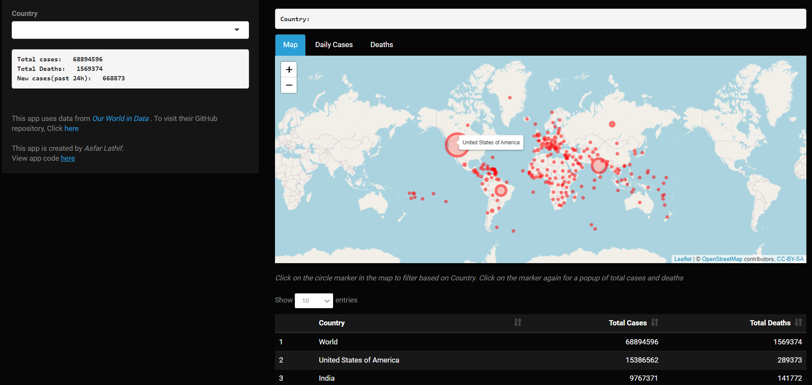
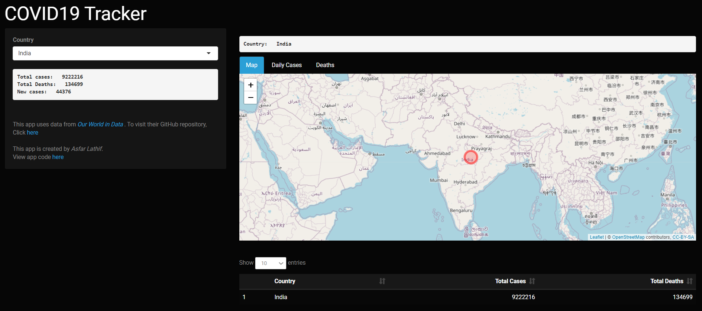
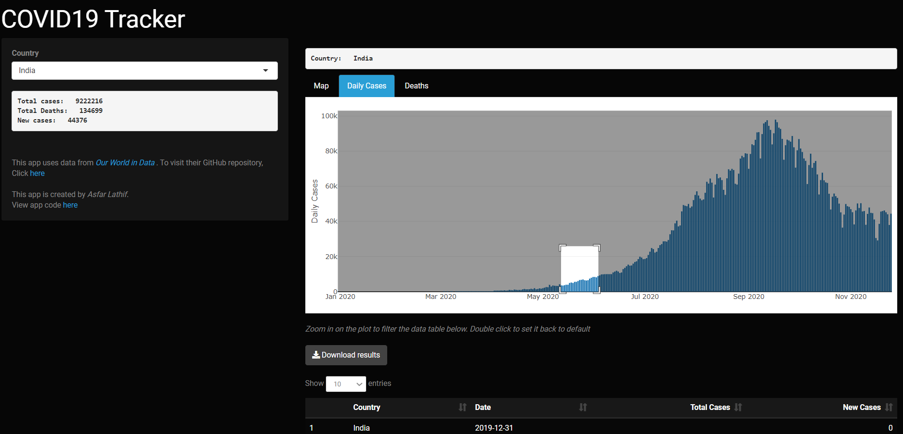
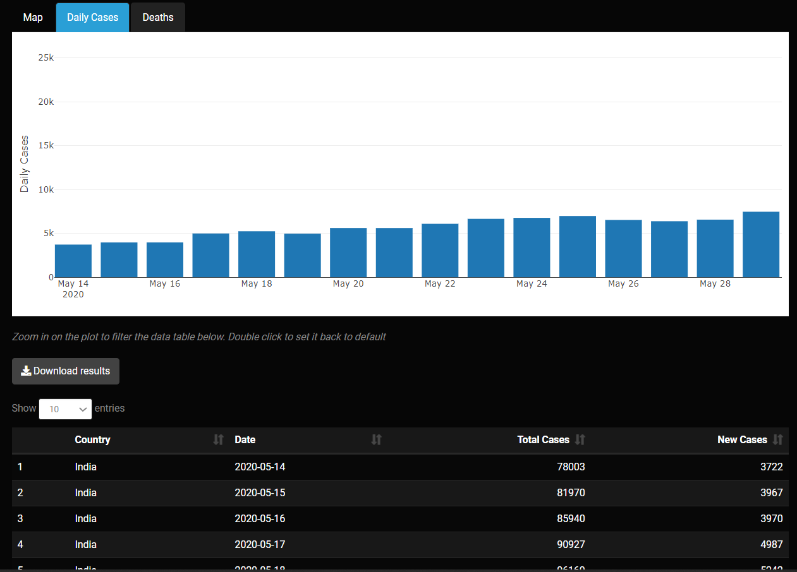

## COVID19 Tracker

For this STAT545B assignment-3b, I decided to go with **Option A** and create my own shiny app called **COVID19 Tracker**.

**COVID19 Tracker** is an application to track the number of cases and deaths due to COVID19 recorded worldwide and in each countries from 31st December 2019 to present day.

It provides features to filter data based on Country name and Date Range.

There are three tabs in the application: **Map**, **Cases**, **Deaths**

The main page ("Map" tab) of the application has an interactive *leaflet* map that shows total number of cases in each country as you hover over it. Below the map is a  data table with information of the total number of recorded cases and deaths in all countries.

The "Cases" and "Deaths" tab have a bar graph showing number of **new** cases and deaths respectively recorded everyday. By default this shows data from 31st December 2019 to present day. Below the plot is a downloadable table that contains details on new cases/deaths and total number cases/deaths for each day. 

The plot is interactive and the user can zoom in on the plots to a specific date range. Accordingly, the table below also filters to display data to only those dates on the plot. Country based filter can also be applied here from the side panel.

The data here is updated once daily. 

APP Link: https://alathif.shinyapps.io/covidtrack/

### DATA SOURCE:

The data used in this application is obtained from dataset maintained by [*Our World in Data*](https://ourworldindata.org/coronavirus). 

This data has been collected, aggregated, and documented by Cameron Appel, Diana Beltekian, Daniel Gavrilov, Charlie Giattino, Joe Hasell, Bobbie Macdonald, Edouard Mathieu, Esteban Ortiz-Ospina, Hannah Ritchie, Max Roser.

The mission of *Our World in Data* is to make data and research on the world's largest problems understandable and accessible.

Press [here](https://covid.ourworldindata.org/data/owid-covid-data.csv) to download the raw csv data.

Their GitHub repository can be found [here](https://github.com/owid/covid-19-data/tree/master/public/data). More details and code book for the data variables are al available here

